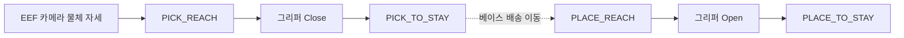

# OMX Arm-Only RL Training

`omx_train_ws`는 TurtleBot3 Waffle Pi와 OpenMANIPULATOR-X를 사용하는 배송 로봇의 **팔 전용 PPO 학습 저장소**다. 정책은 `joint1`~`joint4`만 제어하며, 베이스 이동과 그리퍼 개폐는 런타임 상태 머신이 담당한다.

## 학습 임무



학습 episode에는 베이스 주행을 넣지 않는다. 픽업과 배송 위치에서 로봇이 동일 규격 타워를 같은 상대 자세로 바라본다고 가정하고, 타워 하나를 두 phase에 재사용한다.

현재 구현은 `PICK_REACH → GRIPPER_CLOSE → PICK_TO_STAY`와 `PLACE_REACH → GRIPPER_OPEN → PLACE_TO_STAY`를 모두 포함한다. 물체 자세는 EEF 영상 자체가 아니라 실제 로봇의 `omx_eef_vision`이 발행하는 ArUco 기반 `base_link` 좌표와 같은 형식으로 정책에 들어간다.

## 장면 계약

| 요소 | 값 |
|---|---|
| 모델 | `assets/mjcf/turtlebot3_manipulator/scene.xml` |
| 작업 타워 | `13 × 13 × 17 cm` |
| 배송 상자 | `6 × 5.5 × 5.5 cm` |
| 타워 중심 | `[0.27, 0.0, 0.085] m` |
| 상자·배치 목표 중심 | `[0.27, 0.0, 0.1975] m` |
| MuJoCo 계약 | `nq/nv/nu = 8/8/5` |
| Stay 팔 자세 | `[0.104311, 0.027612, -0.001534, -1.638291] rad` |
| 정책 action | 4차원 `joint1`~`joint4` 잔차 보정, 기준 명령의 `10%` |
| 관측 계약 | 33차원, phase 포함 |
| PPO 장치 | CUDA GPU (`cuda`) |

## 제어 구조

현재 정책은 관절 목표 전체를 PPO에 맡기지 않는다. ArUco 위치로 계산한 충돌 회피 관절 경로가 기준 명령을 만들고, PPO는 각 축에 `[-0.1, 0.1]` 범위의 보정만 더한다. 파지 gate가 처음 성립하면 기준 자세를 고정해 연속 검출을 기다리고, 그리퍼 close와 파지 후 Stay 복귀는 같은 상태 머신 계약을 사용한다.

```text
control_action = clip(reference_action + 0.10 * ppo_action, -1, 1)
joint_target += low_pass(control_action, 0.18) * 0.014 rad
```

이 정책의 action schema는 `v2`다. 실제 로봇에서도 기준 경로, 필터, 스케일을 재현하지 않으면 정책만 단독으로 실행할 수 없다.

## 비정형 물체 위치

상자 중심은 매 episode마다 타워 상면에서 달라진다. 상자 yaw에 따른 회전 footprint를 계산해 네 모서리가 타워를 벗어나지 않는 위치만 허용하고, 전체 표본의 `40%`는 가장자리 구간에서 뽑는다. 설정 범위는 중심 기준 최대 `±24 mm`지만 실제 샘플 한계는 회전된 상자 footprint에 따라 축별로 줄어든다.

```text
center_reach         -> 중앙 ±4 mm에서 접근·파지 학습
grasp_return_center  -> 파지된 자세에서 Stay 복귀 학습
center_mixed         -> 접근 episode와 Stay 복귀 episode를 50:50 혼합
full_tower           -> 안전 상면 전체 ±24 mm + 임의 yaw
aruco_robust         -> 위치/yaw 오차, 2-step 갱신, 짧은 dropout 추가
place_full_tower     -> 배송 타워 전개, 상자 해제, 빈 팔 Stay 복귀
pick_place_mixed     -> 파지와 배송 episode를 50:50 혼합
base_stop_robust     -> 타워 상대 정지 위치 X ±12 mm, Y ±20 mm
height_robust        -> 타워 높이 ±15 mm, 상자 크기 95~105%
sim2real_robust      -> 동역학·마찰·명령 지연·Vision 오차 동시 랜덤화
```

Stay에서 상자로 바로 관절을 펴면 차체 상판과 충돌하므로, `PICK_REACH` 내부에서 차체 위 안전점과 전방 안전점을 순서대로 통과한다. EEF 파지 기준은 상자 중심보다 `22.5 mm` 위이며, 그리퍼는 파지 gate를 연속 통과하기 전까지 `0.019 m` 최대 개방을 유지한다.

MJCF와 필요한 STL은 저장소 안에 함께 보관한다. 정확한 해시는 `assets/mjcf/turtlebot3_manipulator/model_manifest.yaml`에서 확인한다.

## 디렉터리

```text
assets/       MuJoCo 장면, mesh, 모델 manifest
configs/      장면·관절 한계·PPO 계약
docs/         학습, 평가, Sim2Real 계획
envs/         Gymnasium 환경
train/        PPO 학습 진입점
eval/         고정 seed 및 randomization 평가
policies/     checkpoint와 배포 artifact
ros_export/   ROS 2 추론 패키지용 export
scripts/      모델·정책 계약 검사
```

## 검증과 학습

```bash
cd /home/ktj/omx_train_ws
uv run --frozen python scripts/test_load_model.py
uv run --frozen python scripts/check_grasp_env.py --stage full_tower --samples 20
```

첫 명령은 모델, 자유도, 타워·상자 치수와 1000-step 시뮬레이션을 확인한다. 두 번째 명령은 33/4 관측·행동 계약과 무작위 상면 위치의 충돌 없는 파지 가능성을 확인한다.

```bash
# PPO 파이프라인 1-rollout 검사
uv run --frozen python -m train.train_grasp_ppo \
  --smoke --n-envs 2 --output-dir /tmp/omx_grasp_residual_smoke

# 비정형 전체 상면 학습
uv run --frozen python -m train.train_grasp_ppo \
  --stage full_tower --output-dir policies/latest/arm_grasp_residual

# ArUco 오차 강건화 재개 학습
uv run --frozen python -m train.train_grasp_ppo \
  --stage aruco_robust \
  --resume policies/latest/arm_grasp_residual/arm_grasp_latest.zip \
  --output-dir policies/latest/arm_grasp_residual

# 최종 배송 정책의 전체 Sim2Real 평가
uv run --frozen python -m eval.evaluate_grasp_policy \
  --policy policies/latest/arm_delivery_residual_v3_robot_stay/arm_grasp_latest.zip \
  --stage sim2real_robust --episodes 100 --seed 20260718

# 파지/배송 혼합 정책 재생
uv run --frozen python scripts/view_grasp_policy.py
```

## 현재 기준 결과

평가 seed `20260718`을 사용한 결정론적 100 episode 결과다.

| 평가 조건 | 성공률 | Pick | Place | 충돌률 |
|---|---:|---:|---:|---:|
| 전체 타워 파지 | `98%` | `98%` | - | `2%` |
| 전체 타워 놓기·복귀 | `99%` | - | `99%` | `1%` |
| Pick/Place 혼합 | `99%` | `100%` | `98.0%` | `1%` |
| 베이스 정지 위치 변동 | `93%` | `89.8%` | `96.1%` | `7%` |
| 타워 높이·상자 크기 변동 | `88%` | `87.8%` | `88.2%` | `12%` |
| 전체 Sim2Real randomization | `95%` | `95.9%` | `94.1%` | `5%` |

선택된 체크포인트의 SB3 누적 counter는 `660,000` step이다. 기준 정책은 `policies/latest/arm_delivery_residual_v3_robot_stay/arm_grasp_latest.zip`이며 SHA-256은 `07b69c0680521413ca8c40bf37c93993d74d47ccedc48f0c2ab7cb0a7991d6fe`다. 새 정책은 실기 bringup과 같은 Stay 자세로 처음부터 재학습했다. 높이 변동 단독 평가는 동일 seed의 v2 `91%`보다 낮은 `88%`이므로 양의 X 끝단을 실기 안전 제한 구간으로 유지한다. 상세 변경과 평가 근거는 `docs/PPO 재학습 기록 2026-07-18.md`에서 확인한다.
