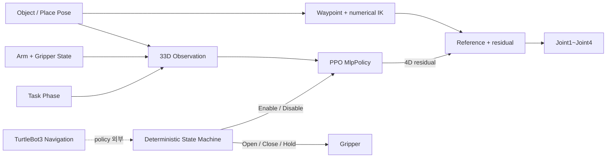
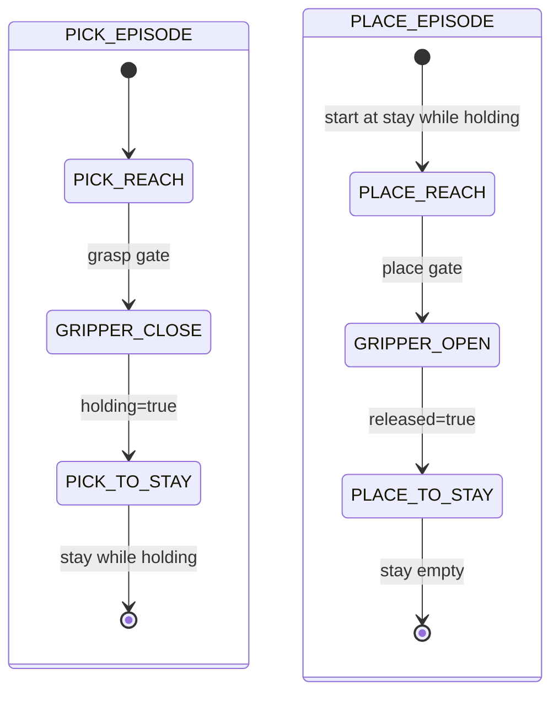
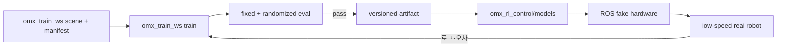

# Arm-Only PPO Training Plan

작성 기준일: 2026-07-17

이 문서는 `/home/ktj/omx_train_ws`에서 OpenMANIPULATOR-X 팔 전용 PPO 정책을 학습하고, 결과를 `/home/ktj/omx_turtle_ws/src/omx_rl_control`에 적용하기 위한 기준안이다. 학습 장면의 기준 모델은 이 저장소 안의 독립형 smooth-control MJCF를 사용한다.

> 핵심 결정: PPO action은 `joint1`~`joint4` 기준 경로에 더하는 4차원 잔차만 사용한다. 기준 제어기, PPO 보정 계수 `0.10`, 저역통과 필터까지가 하나의 배포 계약이며 TurtleBot3 베이스와 그리퍼는 학습하지 않는다.

## 1. 저장소 역할

| 경로 | 역할 | 변경 원칙 |
|---|---|---|
| `/home/ktj/mujoco_ws` | 기존 보상·안전 조건과 환경 구현 참고 | 레거시 참고 저장소 |
| `/home/ktj/omx_train_ws` | 팔 전용 장면·환경·PPO 학습·평가·정책 export | 강화학습 모델의 기준 저장소 |
| `/home/ktj/omx_turtle_ws/src/omx_rl_control` | ROS 2 실시간 추론·상태 머신·안전 제한 | 검증된 artifact만 배포 |
| `/home/ktj/omx_turtle_ws/src/omx_eef_vision` | ArUco·TF 기반 목표 자세 생성 | 영상은 정책 입력으로 직접 사용하지 않음 |

일상적인 개발은 `omx_train_ws`와 `omx_rl_control` 사이에서 진행한다. 로봇 치수나 장면을 바꾸면 `omx_train_ws`의 모델 계약 검사를 먼저 통과시키고, 검증된 정책과 metadata만 런타임으로 배포한다.

## 2. 로봇 모델 기준

### 사용 모델

```text
/home/ktj/omx_train_ws/assets/mjcf/turtlebot3_manipulator/
├── scene.xml
├── model_manifest.yaml
└── meshes/open_manipulator_x/
```

| 항목 | 확인값 |
|---|---|
| MuJoCo 로딩 | `/home/ktj/omx_train_ws/.venv`의 MuJoCo 3.10.0에서 성공 |
| `nq / nv / nu` | `8 / 8 / 5` |
| 팔 actuator | `joint1_position`~`joint4_position` |
| 그리퍼 actuator | `gripper_position` |
| keyframe | `stay`, `moveit_home` |
| Stay 팔 자세 | `[0.104311, 0.027612, -0.001534, -1.638291] rad` |
| EEF 카메라 | `eef_usb_camera`, `eef_usb_camera_optical_frame` 포함 |
| 작업 타워 | `0.13 × 0.13 × 0.17 m`, 중심 `[0.27, 0.0, 0.085]` |
| 배송 상자 | `0.06 × 0.055 × 0.055 m`, 초기 중심 `[0.27, 0.0, 0.1975]` |
| 모델 SHA-256 | `2443c015eae20d4b8a5a09ce8e8bd48c0a355f4f7e1aebc7f663b6bc4fd5a9ad` |

이 SHA-256은 2026-07-16에 동기화한 기준이다. 모델과 여섯 개 mesh의 해시는 같은 디렉터리의 `model_manifest.yaml`에 고정한다.

| 관절 | smooth MJCF 범위 |
|---|---:|
| `joint1` | `[-2.82743, 2.82743] rad` |
| `joint2` | `[-1.79071, 1.57080] rad` |
| `joint3` | `[-0.942478, 1.38230] rad` |
| `joint4` | `[-1.79071, 2.04204] rad` |
| gripper | `[-0.010, 0.019] m` |

`configs/robot_limits.yaml`은 위 MJCF 범위와 Stay 자세를 동일하게 사용한다. 학습 환경과 런타임은 이 범위를 공통 계약으로 취급한다.

### 모델 사용 방식

학습 코드는 저장소 루트 기준의 아래 상대 경로를 사용한다.

```yaml
model_path: assets/mjcf/turtlebot3_manipulator/scene.xml
```

MJCF의 mesh는 `scene.xml` 옆 `meshes/open_manipulator_x`에 포함되어 외부 워크스페이스 없이 로드된다. 학습 시작 전 `uv run --frozen python scripts/test_load_model.py`로 자유도, 필수 이름, 타워·상자 치수와 1000-step 시뮬레이션을 검증한다.

## 3. 기존 정책에서 재사용할 것

기준 자료는 다음과 같다.

```text
/home/ktj/mujoco_ws/configs/ppo_handoff_smooth_control.yaml
/home/ktj/mujoco_ws/envs/turtlebot3_manipulator_env.py
/home/ktj/mujoco_ws/docs/ppo_handoff_smooth_control_model.md
/home/ktj/mujoco_ws/runs/ppo_handoff_smooth_control/
└── ppo_handoff_smooth_control_latest.zip
```

| 재사용 | 재사용하지 않음 |
|---|---|
| smooth MJCF와 관절 한계 | 기존 5차원 정책 가중치 직접 로딩 |
| `0.02 s` 환경 step | 정책의 gripper action |
| `0.014 rad` action scale | 로봇 베이스 행동 공간 |
| `0.18` action low-pass 계수 | 기존 전체 handoff 관측 벡터 |
| 파지 거리·XY·Z·bearing gate | 넓은 `0.160 m` 최종 place 허용반경 |
| self-collision과 smoothness penalty 구조 | 기존 정책 성공률을 새 정책 성능으로 간주 |

기존 `ppo_handoff_smooth_control_latest.zip`은 팔 4축과 그리퍼를 포함한 5차원 action으로 학습됐다. 새 정책은 action과 observation shape이 달라지므로 이어서 학습하지 않고 새로 초기화한다.

첫 기준 모델은 **Gymnasium + MuJoCo + Stable-Baselines3 PPO `MlpPolicy`**로 학습한다. 기존 환경과 보상 구조를 가장 적은 변경으로 검증할 수 있기 때문이다. Brax/MJX 전환은 4차원 action·33차원 observation·평가 기준이 먼저 안정된 뒤 별도 단계로 진행하며, 같은 실험에서 SB3와 Brax 구현을 섞지 않는다.

## 4. 학습 범위



### 정책이 수행하는 동작

| Phase | 정책 목표 | 그리퍼 상태 |
|---|---|---|
| `PICK_REACH` | Vision이 갱신하는 물체 pre-grasp 자세로 접근 | 최대 개방 유지 |
| `PICK_TO_STAY` | 물체를 잡은 상태로 Stay 자세 복귀 | 닫기·파지 유지 |
| `PLACE_REACH` | 배송 목표 자세로 팔 전개 | 파지 유지 |
| `PLACE_TO_STAY` | 물체 해제 후 Stay 자세 복귀 | 최대 개방 유지 |

TurtleBot3가 픽업 위치 또는 배송 위치로 이동하는 동안 정책은 실행하지 않는다. 팔은 Stay 자세를 유지하고, 픽업 후 배송 중에는 그리퍼 닫기 명령을 유지한다.

## 5. 행동 공간

```text
action.shape = (4,)
action range = [-1, 1]
action order = [joint1, joint2, joint3, joint4]
action semantics = residual correction
action schema version = 2
```

정책 출력 처리 순서는 학습과 런타임에서 동일해야 한다.

```text
reference_action_t = clip(
    (reference_joint_target_t - joint_target_(t-1)) / 0.014,
    -1,
    1
)

control_action_t = clip(
    reference_action_t + 0.10 * ppo_action_t,
    -1,
    1
)

filtered_action_t = previous_filtered_action
                    + 0.18 * (control_action_t - previous_filtered_action)

joint_target_t = clip(
    joint_target_(t-1)
    + filtered_action_t * [0.014, 0.014, 0.014, 0.014],
    joint_lower_limit,
    joint_upper_limit
)
```

그리퍼 actuator가 MuJoCo 모델에 존재하더라도 PPO action에는 포함하지 않는다. 환경 상태 머신이 `data.ctrl[4]`를 직접 설정한다.

기준 경로는 Stay에서 차체 위 안전점, 전방 안전점, ArUco pre-grasp IK 순서로 진행한다. PPO를 제거하고 0 잔차를 넣어도 기본 임무를 수행할 수 있어야 하며, PPO는 비정형 위치·관측 오차·동역학 편차를 보정한다.

`configs/task_pick_place.yaml`과 `configs/arm_only_delivery_ppo.yaml`은 베이스와 그리퍼를 PPO action에서 제외한다. 환경 상태 머신만 그리퍼 actuator를 명령한다.

## 6. 관측 공간

모든 위치는 ROS의 `base_link`에 대응하는 로봇 고정 기준 좌표와 SI 단위로 통일한다. 영상 자체를 PPO 입력으로 사용하지 않고, ArUco가 생성한 자세를 시뮬레이션의 목표 좌표와 같은 형식으로 넣는다.

| 범위 | 값 | 정규화 기준 |
|---|---|---|
| `0:4` | 팔 관절 위치 | 각 관절 ctrlrange |
| `4:8` | 팔 관절 속도 | 실기기 허용 속도 |
| `8` | 그리퍼 위치 | `[-0.010, 0.019] m` |
| `9` | 그리퍼 속도 | 실기기 허용 속도 |
| `10:13` | EEF 위치 | 작업영역 범위 |
| `13:16` | 활성 목표 위치 | 작업영역 범위 |
| `16:19` | 목표-EEF 위치 오차 | 작업영역 범위 |
| `19:21` | 목표 bearing | `sin`, `cos` |
| `21:23` | 목표 yaw | `sin`, `cos` |
| `23` | gripper roll 오차 | `[-pi, pi]` |
| `24` | 물체 파지 상태 | 0 또는 1 |
| `25:29` | phase one-hot | 4개 phase |
| `29:33` | 이전 팔 action | `[-1, 1]` |

관측값 순서는 변경하지 않는다. 필드가 추가되면 `observation_schema_version`을 올리고 기존 정책과 호환되지 않는 새 모델로 취급한다.

## 7. Vision 좌표를 학습에 반영하는 방법

실기기 파이프라인은 다음과 같다.

```text
EEF image
  -> ArUco pose in camera_optical_frame
  -> TF transform to base_link
  -> filter and validity gate
  -> PPO target position/yaw
```

학습 환경에서는 카메라 렌더링이나 ArUco 검출을 실행하지 않는다. 대신 MuJoCo의 실제 물체 자세에 측정된 Vision 오차 모델을 적용하고, 필터링된 관측 자세로 기준 waypoint bearing과 pre-grasp IK를 계산한다.

| Randomization | 적용 목적 |
|---|---|
| 위치 노이즈 | ArUco translation 오차 재현 |
| yaw 노이즈 | marker 회전 추정 오차 재현 |
| 지연·저주기 갱신 | 카메라와 TF 처리 지연 재현 |
| 짧은 dropout | 팔이 가리는 구간 재현 |
| 이상치 | 런타임 jump reject와 Hold 동작 검증 |

노이즈 수치는 임의로 확정하지 않는다. 먼저 `omx_eef_vision`에서 정지 물체와 움직이는 EEF 데이터를 기록하고, 위치 표준편차·지연·dropout 비율의 95 percentile을 측정해 설정한다.

`PICK_REACH`에서는 저역통과 계수 `0.35`로 목표 자세를 갱신한다. 파지 gate가 처음 성립하면 관절 기준을 고정하고, 연속 프레임 조건을 만족해 그리퍼가 닫히는 동안에는 목표를 변경하지 않는다. dropout 중에는 마지막 유효 자세를 관측에 유지하되 새 close 전이는 허용하지 않는다.

## 8. 결정론적 그리퍼 제어

| 상태 | MuJoCo 명령 | 전이 조건 |
|---|---:|---|
| `OPEN_FOR_PICK` | `0.019 m` | 최대 개방 도달 |
| `HOLD_OPEN` | `0.019 m` | 파지 gate 진입 전 |
| `CLOSE_GRASP` | `-0.010 m` 방향 | 파지 gate 연속 만족 |
| `HOLD_OBJECT` | 파지 시 닫기 목표 유지 | 물체가 EEF를 따라 이동 |
| `OPEN_RELEASE` | `0.019 m` | 배송 배치 gate 만족 |
| `HOLD_OPEN_AFTER_RELEASE` | `0.019 m` | `PLACE_TO_STAY` 종료까지 |

시뮬레이션에서는 기존 환경의 contact/near 조건과 물체 latch 방식을 재사용할 수 있다. 실기기에서는 그리퍼 Action 성공만으로 파지를 판정하지 않고, 가능하면 모터 부하와 Vision 기반 물체 추종을 함께 사용한다.

## 9. Episode 구성

전체 배송 주행을 MuJoCo episode에 넣지 않는다. 팔 정책은 두 종류의 episode를 섞어 학습한다.



이 구성이 베이스 이동을 정책에서 완전히 분리하면서도, 같은 정책이 목표 자세와 phase에 따라 픽업·복귀·배송 전개·최종 복귀를 수행하도록 만든다.

장면에는 `task_tower` 하나만 둔다. 픽업 episode에서는 상자가 타워 위에 놓인 상태로 시작하고, 배송 episode에서는 베이스가 다른 장소의 동일 규격 타워 앞에 정지했다고 가정해 같은 로봇 상대 좌표를 배치 목표로 재사용한다.

## 10. 성공·실패 조건

| 구간 | 성공 조건 | 즉시 실패 조건 |
|---|---|---|
| `PICK_REACH` | 거리 `<=0.042 m`, XY `<=0.035 m`, Z `<=0.030 m`, bearing·roll `<=0.35 rad`를 4 step 유지 | 보호 충돌 깊이 `>=0.004 m`, 비정상 수치, 시간 초과 |
| `PICK_TO_STAY` | holding 유지 + Stay 관절 오차 `<=0.05 rad`를 8 step 유지 | 물체 낙하, 보호 충돌 |
| `PLACE_REACH` | 배송 자세·roll·방향 gate 충족 | 물체 낙하, self-collision, 시간 초과 |
| `PLACE_TO_STAY` | 물체 해제 + Stay 관절 오차 `<=0.04 rad` | self-collision, 시간 초과 |

배송 배치 반경은 기존 모델의 `0.160 m`를 그대로 쓰지 않는다. 고정 목표에서 시작해 실제 배송 상자와 적재면 치수에 맞는 최종 허용오차까지 단계적으로 줄인다.

## 11. 보상 설계

보상은 목표에 가까운 자세보다 **안전하게 목표로 진행하는 변화량**을 중심으로 둔다.

```text
reward = + target_progress
         - target_distance
         - path_line_error
         - action_delta_cost
         - action_jerk_cost
         - joint_velocity_cost
         - joint_limit_cost
         - self_collision_cost
         - time_cost
         + phase_success_bonus
         - object_drop_penalty
```

| 항목 | 적용 phase | 목적 |
|---|---|---|
| EEF-목표 거리 감소 | 전 phase | 목표 접근 유도 |
| 직선 경로 오차 | `PICK_REACH`, `PLACE_REACH` | 불필요한 우회 억제 |
| Stay 관절 오차 감소 | 두 `*_TO_STAY` | 안전 자세 복귀 |
| action delta·jerk | 전 phase | 실기기 진동 억제 |
| 관절 속도 | 전 phase | Dynamixel 급가속 억제 |
| self-collision | 전 phase | 차체·카메라·팔 충돌 방지 |
| holding 유지 | 물체 파지 phase | 배송 중 낙하 방지 |
| 조기 접근 성공 | 각 phase 종료 | 짧고 안정적인 동작 유도 |

기존 smooth-control 값 `action_delta_cost_weight=3.0`, `action_jerk_cost_weight=4.0`, `joint_velocity_cost_weight=0.003`을 초기값으로 사용하고, 학습 curve와 실제 trajectory를 함께 보고 조정한다.

## 12. Curriculum

| 단계 | 학습 내용 | 완료 기준 | 2026-07-17 상태 |
|---|---|---|---|
| C0 | 고정 목표 reach, 빈 그리퍼 | 성공률 `>=95%` | 완료 |
| C1 | 좁은 XY 범위의 `PICK_REACH` | 파지 gate 진입률 `>=90%` | 완료 |
| C2 | 결정론적 close + `PICK_TO_STAY` | Stay holding 성공률 `>=90%` | 완료 |
| C3 | 물체 XYZ·yaw 범위 확대 | 위치 구간별 성공률 `>=85%` | 완료 |
| C4 | Vision 노이즈·지연·dropout | 전체 픽업 성공률 `>=85%` | 완료 |
| C5 | 고정 배송 목표 `PLACE_REACH` | release gate 진입률 `>=90%` | 완료 |
| C6 | 배송 목표 범위 확대 + `PLACE_TO_STAY` | 배치·복귀 성공률 `>=90%` | 완료, 99% |
| C7 | PICK/PLACE episode 혼합 | 전체 arm cycle 성공률 `>=90%` | 완료, 98% |
| C8 | 정지 위치·타워 높이·상자 크기 변동 | 전체 성공률 `>=90%` | 보완 필요, 89% |
| C9 | 동역학·마찰·Vision·지연 동시 변동 | 전체 성공률 `>=90%` | 완료, 92% |

물체 높이 일반화는 별도 축으로 관리한다. 기존 모델은 `object_range.z=0.0`이므로, 실측 작업 높이를 정한 뒤 작은 Z 범위부터 확대하고 pre-grasp·close·lift·collision gate를 함께 조정한다.

## 13. Domain Randomization

| 범주 | 대상 |
|---|---|
| 물체 | XYZ, yaw, 크기, 질량, 마찰 |
| 로봇 | 관절 damping, actuator gain, payload 영향 |
| 제어 | 관절 상태 지연, 명령 지연, 제어 주기 jitter |
| 인식 | 위치·각도 노이즈, dropout, 이상치 |
| 초기 상태 | Stay 관절 편차, 그리퍼 위치 편차 |

각 범위는 한 번에 넓히지 않는다. 고정 조건 성공 모델을 저장하고, randomization 축을 하나씩 추가해 성능 저하 원인을 추적한다.

## 14. 평가 기준

| 지표 | 목표 |
|---|---:|
| Pick reach 성공률 | `>= 95%` |
| 파지 후 Stay 복귀 성공률 | `>= 90%` |
| Place·release·Stay 성공률 | `>= 90%` |
| 전체 arm cycle 성공률 | `>= 90%` |
| Self-collision | `0회` |
| 물체 낙하 | `0회` |
| NaN·관절 한계 위반 | `0회` |
| 평가 seed | 학습 seed와 분리, 최소 100 episode |

평균 성공률만 보지 않고 물체 위치와 높이를 구간으로 나눠 최저 구간 성공률을 기록한다. 정책 선택 순서는 충돌·낙하 0 여부, 전체 성공률, 최저 구간 성공률, action jerk, 평균 완료 시간 순으로 둔다.

현재 최종 Sim2Real 정책은 전체 성공률 92%로 성공률 목표는 통과했지만 충돌률 7%로 충돌 0회 목표는 통과하지 못했다. 실기기 배포 전 양의 X 끝단 접근을 보완해야 한다. 원본 평가는 `policies/latest/arm_delivery_residual_v2/evaluation/`에 보관한다.

## 15. 배포 artifact 계약

```text
policies/exported/<policy_version>/
├── policy.zip
├── policy_metadata.yaml
├── training_config.yaml
├── evaluation.yaml
├── source_model_manifest.yaml
└── SHA256SUMS
```

`policy_metadata.yaml` 필수 필드는 다음과 같다.

| 필드 | 내용 |
|---|---|
| `policy_version` | 사람이 읽을 수 있는 불변 버전 |
| `observation_schema_version` | 33차원 필드 순서 버전 |
| `action_schema_version` | 4차원 관절 순서 버전 |
| `control_mode` | `reference_plus_residual` |
| `residual_action_scale` | `0.10` |
| `joint_names` | `[joint1, joint2, joint3, joint4]` |
| `control_period_s` | `0.02` |
| `action_scale` | `[0.014, 0.014, 0.014, 0.014]` |
| `action_filter_coef` | `0.18` |
| `normalization` | 관측 필드별 offset·scale |
| `stay_joint_positions` | `[0.104311, 0.027612, -0.001534, -1.638291]` |
| `model_sha256` | 학습에 사용한 MJCF checksum |
| `config_sha256` | 학습 설정 checksum |
| `framework_versions` | Python, MuJoCo, Gymnasium, SB3 버전 |

`omx_rl_control`은 메타데이터와 실제 ROS 관절 이름·관측 길이·checksum이 다르면 모델을 로드하지 않는다.

## 16. 두 저장소 작업 흐름



| 작업 | 디렉터리 | 산출물 |
|---|---|---|
| 모델 무결성 확인 | `/home/ktj/omx_train_ws/assets` | model hash·manifest·계약 검사 |
| 환경·보상 수정 | `/home/ktj/omx_train_ws` | config와 환경 코드 |
| 학습·평가 | `/home/ktj/omx_train_ws` | checkpoint와 평가표 |
| 정책 배포 | `omx_rl_control/models/<version>` | 검증된 artifact bundle |
| ROS·실기기 검증 | `/home/ktj/omx_turtle_ws` | 상태·trajectory·실패 로그 |

실기기에서 임계값이나 관측 정규화를 임의로 바꿔 정책에 맞추지 않는다. 변경이 필요한 경우 학습 config와 runtime config를 함께 버전업하고 다시 평가한다.

## 17. 목표 디렉터리 구조

현재 파지 학습 구현의 주요 구조는 다음과 같다.

```text
/home/ktj/omx_train_ws/
├── assets/mjcf/turtlebot3_manipulator/
│   ├── scene.xml
│   ├── model_manifest.yaml
│   └── meshes/open_manipulator_x/
├── configs/
│   ├── arm_grasp_randomized_ppo.yaml
│   ├── arm_only_delivery_ppo.yaml
│   ├── robot_limits.yaml
│   └── task_pick_place.yaml
├── docs/
│   ├── arm_only_rl_training_plan.md
│   ├── arm_delivery_rl_training_run_2026-07-17.md
│   └── grasp_rl_training_run_2026-07-17.md
├── envs/
│   └── arm_randomized_grasp_env.py
├── train/
│   └── train_grasp_ppo.py
├── eval/
│   └── evaluate_grasp_policy.py
├── policies/
│   ├── latest/arm_grasp_residual/
│   └── latest/arm_delivery_residual_v2/
├── test/
│   └── test_arm_randomized_grasp_env.py
└── scripts/
    ├── check_grasp_env.py
    └── test_load_model.py
```

2026-07-17 기준 C0~C9 환경과 학습을 완료했다. 선택된 최종 체크포인트의 SB3 counter는 537,088 step이며 `sim2real_robust` 100회 평가 성공률은 92%, 충돌률은 7%다. C5~C7 배송 전개·해제·복귀는 완료됐고, 양의 X 끝단 충돌 보완이 남았다. 상세 결과는 `arm_delivery_rl_training_run_2026-07-17.md`에 고정한다.

## 18. 구현 순서

1. 완료: 로컬 `scene.xml`과 mesh 의존성 manifest를 고정하고 모델 계약을 검사했다.
2. 완료: 33차원 관측, 4차원 잔차 action, 결정론적 그리퍼 상태 머신을 구현했다.
3. 완료: C0~C4 픽업·Stay·ArUco 강건화 학습을 수행했다.
4. 완료: C5~C7 배송 배치·해제·복귀와 혼합 학습을 수행했다.
5. 완료: 정지 위치·높이·동역학·Vision randomization 학습과 100회 평가를 수행했다.
6. 진행 전: 양의 X 끝단 충돌을 보완하고 충돌 0회 기준으로 재평가한다.
7. 진행 전: 통과 모델을 versioned artifact로 export하고 `omx_rl_control`에 배포한다.
8. 진행 전: ROS fake hardware에서 관측·action 계약을 검증한다.
9. 진행 전: 실기기 저속 시험 로그로 Sim2Real 범위를 보정한다.

## 19. 비범위

- PPO가 ArUco 원본 영상을 직접 처리하는 end-to-end vision 학습
- PPO가 TurtleBot3 선속도·각속도를 출력하는 이동 학습
- PPO가 그리퍼 개폐 시점을 직접 결정하는 학습
- UWB 위치 추정과 배송 경로 계획
- 중앙 서버의 주문·임무 스케줄링

이 항목들은 팔 정책의 입력 계약을 흐리지 않도록 별도 모듈에서 처리한다.
