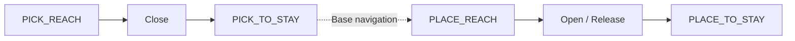

# 팔 배송 PPO 학습 기록

실행일: 2026-07-17

## 학습 범위

13 x 13 x 17 cm 타워 위의 6 x 5.5 x 5.5 cm 상자를 대상으로 팔 전용 배송 동작을 학습했다. PPO는 `joint1`~`joint4` 기준 경로에 더하는 4차원 잔차만 출력한다. 그리퍼 개폐, 파지·해제 gate, 베이스 이동 전환은 결정론적 상태 머신의 책임이다.



배송 episode는 물체를 든 Stay 자세에서 시작한다. 배송 타워로 팔을 전개하고, 배치 gate를 연속 만족하면 상자를 해제한 뒤 빈 팔로 Stay에 복귀한다. 실제 베이스 주행은 MuJoCo episode에 포함하지 않았다.

## 구현된 Curriculum

| 단계 | 지정 rollout budget | 추가 조건 | 정기 평가 최고 |
|---|---:|---|---:|
| `place_center` | 50,000 | 중앙 배송 목표 전개·해제 | 100% |
| `place_return_center` | 40,000 | 해제 후 빈 팔 Stay 복귀 | 100% |
| `place_full_tower` | 80,000 | 전체 타워 위치·임의 yaw | 100% |
| `pick_place_mixed` | 100,000 | Pick/Place 50:50 | 100% |
| `base_stop_robust` | 100,000 | 타워 X ±12 mm, Y ±20 mm | 96% |
| `height_robust` | 100,000 | 타워 높이 ±15 mm, 상자 크기 95~105% | 98% |
| `sim2real_robust` | 160,000 | 동역학·마찰·Vision·명령 지연 동시 변동 | 98% |

정기 평가는 단계별 50 episode다. PPO rollout은 `8 env x 512 step` 단위라 지정 budget을 조금 넘겨 종료될 수 있다. 재시도와 폐기된 rollout이 있으므로 최종 metadata의 `537,088`은 선택된 체크포인트 계보의 SB3 counter이며 전체 연산량의 합계가 아니다.

## 안정화 조치

첫 번째 연속 학습에서는 각 단계의 마지막 모델을 다음 단계로 넘겨 `place_full_tower` 성능이 96%에서 78%까지 하락했다. 실패는 주로 양의 X 가장자리에서 PPO 잔차가 기준 경로를 타워 쪽으로 보정하면서 발생했다.

두 번째 실행에는 아래 선택 규칙을 적용했다.

| 항목 | 적용값 |
|---|---|
| 단계 전달 모델 | 마지막 모델이 아닌 `EvalCallback` 최고 모델 |
| PPO learning rate | `1e-4` |
| entropy coefficient | `0.0` |
| 잔차 크기 penalty | `0.05` |
| 기준 제어 + PPO 잔차 | `reference + 0.10 x policy` |

각 단계 종료 후 `best/<stage>/best_model.zip`을 다시 로드해 단계 artifact와 다음 단계 초기값으로 사용했다. 최종 모델은 `sim2real_robust`의 50회 평가 98% 체크포인트다.

## 100회 독립 평가

모든 평가는 최종 정책, 결정론적 action, seed `20260717`로 실행했다.

| Stage | 전체 성공 | Pick 성공 | Place 성공 | 충돌 | 평균 step |
|---|---:|---:|---:|---:|---:|
| `full_tower` | 97% | 97% | - | 3% | 288.58 |
| `place_full_tower` | 99% | - | 99% | 1% | 301.12 |
| `pick_place_mixed` | 98% | 100% | 95% | 2% | 340.69 |
| `base_stop_robust` | 89% | 91.7% | 85% | 11% | 355.76 |
| `height_robust` | 89% | 91.7% | 85% | 11% | 372.37 |
| `sim2real_robust` | 92% | 91.7% | 92.3% | 7% | 418.79 |

`sim2real_robust`는 다음 변동을 동시에 적용한다.

| 축 | 범위 |
|---|---|
| 타워 상대 정지 위치 | X ±12 mm, Y ±20 mm |
| 타워 높이 | ±15 mm |
| 상자 크기 | 90~110% |
| 관절 damping | 80~120% |
| actuator gain | 85~115% |
| 마찰 | 70~130% |
| PPO 잔차 지연 | 0~2 step |
| ArUco 위치·yaw 잡음 | 3 mm, 0.05 rad |
| Vision 갱신·dropout | 3 step, 5% |

전체 Sim2Real 조건은 90% 목표를 통과했지만 충돌 0회 기준은 통과하지 못했다. `base_stop_robust`와 `height_robust`도 각각 89%다. 실패는 양의 X 위치 버킷에 집중됐으며 `base_stop_robust`의 `x_pos__y_pos` 성공률은 45.5%였다. 따라서 이 모델은 **시뮬레이션 기준 정책**이며 속도 제한·충돌 감시 없이 실기기에 바로 배포할 상태는 아니다.

## 산출물

| 파일 | 용도 |
|---|---|
| `policies/latest/arm_delivery_residual_v2/arm_grasp_latest.zip` | 최종 선택 정책 |
| `policies/latest/arm_delivery_residual_v2/policy_metadata.yaml` | 관측·action·완료 단계 계약 |
| `policies/latest/arm_delivery_residual_v2/training_config.yaml` | 학습 당시 전체 설정 snapshot |
| `policies/latest/arm_delivery_residual_v2/best/<stage>/best_model.zip` | 단계별 최고 정기 평가 모델 |
| `policies/latest/arm_delivery_residual_v2/evaluation/*_100.yaml` | 고정 seed 100회 평가 원본 |

최종 정책 SHA-256:

```text
d838bab2c6b034252cdf10e52d52a9a77de3bc80f7c9c41ea82554f1b8aa50f2
```

## 정적·환경 검증

| 검사 | 결과 |
|---|---|
| 파지·놓기·혼합·랜덤화 환경 assertion | 6/6 통과 |
| Python 구문 컴파일 | 통과 |
| MJCF·mesh manifest·1000-step simulation | 통과 |
| 정책 33D observation / 4D action metadata 계약 | 통과 |
| 0-잔차 기준 제어기, `sim2real_robust` 20회 | 15/20, 충돌 5회 |

0-잔차 검사는 PPO 보정 없이 기준 경로만 실행한 결과다. 최종 PPO 100회 평가와 혼동하지 않으며, 현재 정책의 개선 효과와 기준 경로 자체의 끝단 취약성을 함께 보여준다.

## 재현 명령

```bash
cd /home/ktj/omx_train_ws

uv run --frozen python -m eval.evaluate_grasp_policy \
  --policy policies/latest/arm_delivery_residual_v2/arm_grasp_latest.zip \
  --stage sim2real_robust \
  --episodes 100 \
  --seed 20260717

uv run --frozen python scripts/view_grasp_policy.py
```

## 다음 검증

1. 양의 X 끝단의 접근 waypoint와 타워 collision margin을 조정하고 해당 버킷을 집중 재학습한다.
2. `omx_rl_control`에 action schema v2 기준 제어와 20 ms 저역통과 필터를 동일하게 구현한다.
3. ROS 2 fake hardware에서 관절 순서, 33차원 관측, phase 전이, 그리퍼 hold를 검증한다.
4. 실제 EEF ArUco 로그의 오차 분포로 Vision randomization 범위를 교체한다.
5. 실기기에서는 저속·비상정지·빈 그리퍼 시험부터 단계적으로 진행한다.
